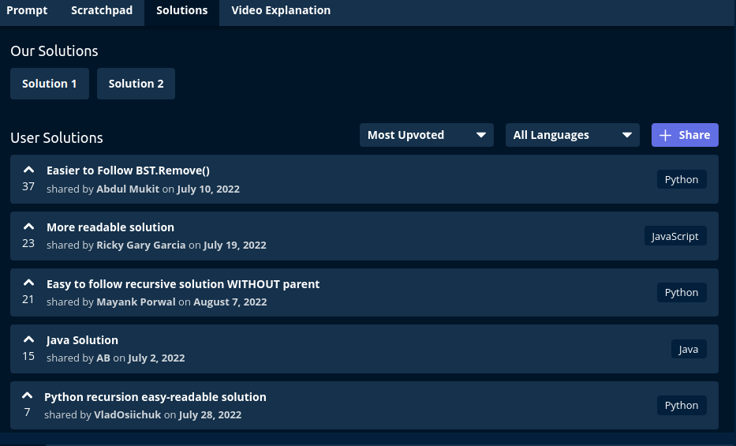
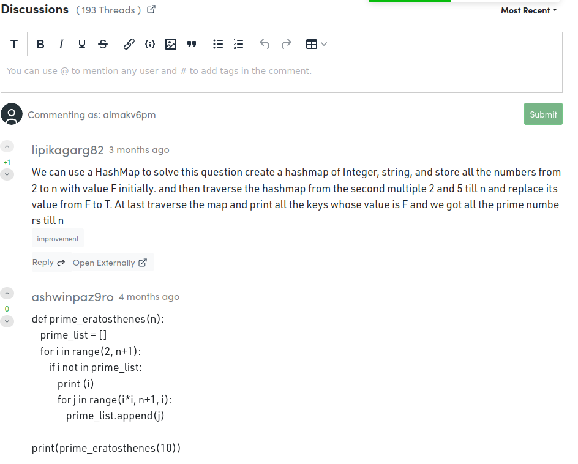

Поставленные задачи в области качества представляют собой отличное начало, однако есть несколько областей, в которых можно сделать улучшения:

Градации: Для более четкой структурированности и оценки сложности задач, возможно, стоит ввести градации https://docs.google.com/spreadsheets/d/1uWQgLylJXXy4ittWcPjev3YUIxQkH1C3Z2aqphsF3ik/edit?usp=sharing. Это поможет лучше оценивать и управлять временем и ресурсами, необходимыми для их выполнения.

Публикация решений и поддержка сообщества: Еще я бы предложила создать блок для обсуждения решений к каждой задаче - где студенты могли бы публикать их решения, через форму и получать плюсы за решение от других участников платформы. Например, вот изображение 

Мониторинг: Введение блока самомониторинга и трекера задач по блокам позволит следить за тем, насколько успешно продвигаются задачи в рамках проекта по обеспечению качества. Такой инструмент может быть полезным для измерения и повышения эффективности выполнения задач.

Спринты: Также я бы предложила ввести спринты , которые также были бы в трекере целей, в результате которого на выходе был бы Проект, который можно выкладывать на гитхаб для создании коллекции проектов для личного портфолио для будущих собеседований:

Например (здесь взяты условные темы):
Недельный спринт 1: Введение в машинное обучение и предобработка данных

День 1: Ознакомление с курсом и целями

День 2-4: Основы машинного обучения и его применение

День 5-7: Предобработка данных, очистка и подготовка данных для анализа

Завершение спринта: Проект 1 - Простой анализ данных и визуализация

Недельный спринт 2: Обучение моделей машинного обучения

День 1-3: Линейная регрессия и классификация

День 4-5: Деревья решений и ансамбли моделей

День 6-7: Оценка моделей и выбор наилучшей модели

Завершение спринта: Проект 2 - Обучение и оценка модели машинного обучения

Недельный спринт 3: Глубокое обучение и нейронные сети

День 1-4: Основы нейронных сетей и глубокого обучения

День 5-6: Работа с библиотеками для глубокого обучения (например, TensorFlow или PyTorch)

День 7: Проект 3 - Построение и обучение нейронной сети

Завершение спринта: Проект 3 - Построение и обучение нейронной сети

Недельный спринт 4: Практические приложения и проекты в машинном обучении

День 1-3: Работа с реальными данными и проектами

День 4-5: Работа в команде и совместные проекты

День 6-7: Завершение курса, оценка успехов и дальнейшие шаги

Завершение спринта: Проект 4 - Продвинутый проект машинного обучения с использованием реальных данных

Сделать все задачи обязательными к выполнению и связать это с трекингом задач по проценту выполнения. Это создаст четкую структуру и укрепит дисциплину в достижении поставленных целей, предотвращая неопределенность и уточняя ожидания относительно задач (возможно в виде некой отдельной вкладки с дашбордом с результатами достижения целей за неделю).
Эти улучшения помогут более эффективно организовать и управлять задачами в области качества, а также обеспечат более четкую систему контроля и отчетности.

Таким образом, студент уже будет получать нечто завершенное в конце каждой недели, пополнять гитхаб, строить портфолио и предпринимать конкретные шаги для построения новой карьеры и новой жизни, то есть будет получать реальные изменения. В конце курса у него будет готов "чемодан", т.е. багаж знаний, который он может разослать при поиске новой работы.
